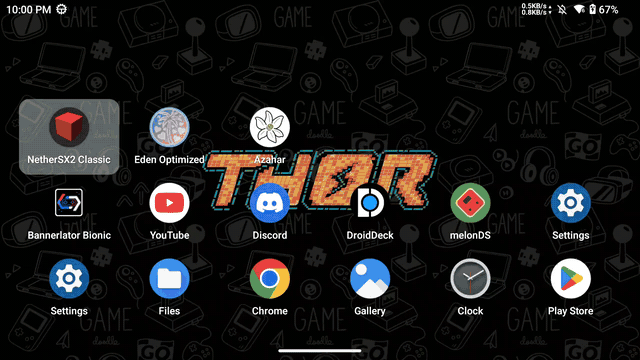
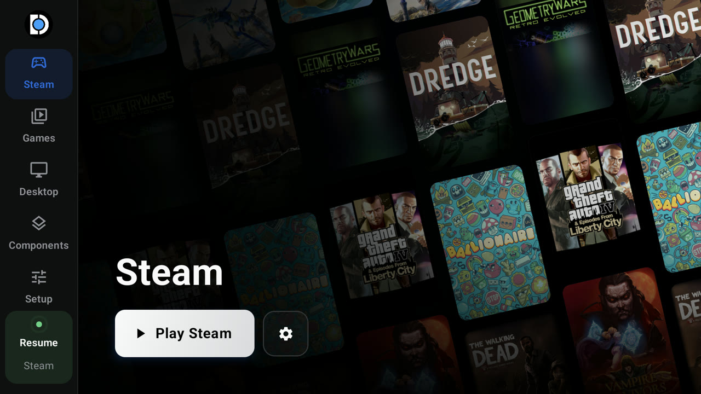
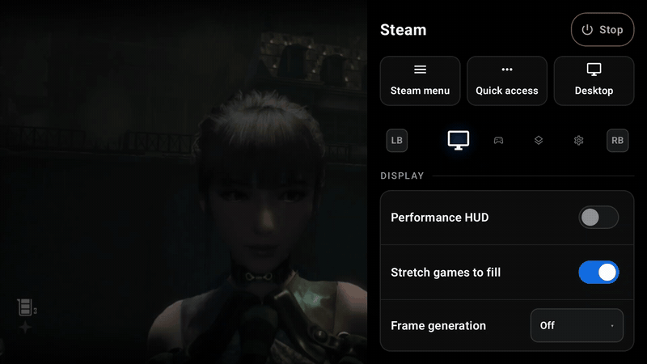
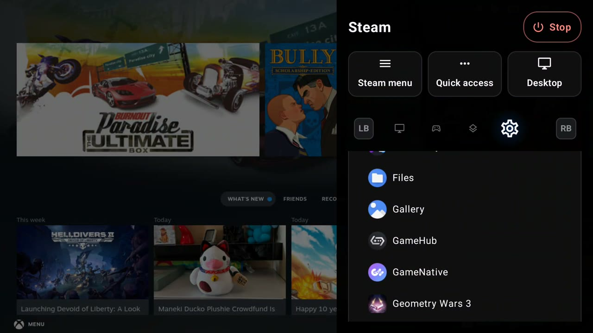
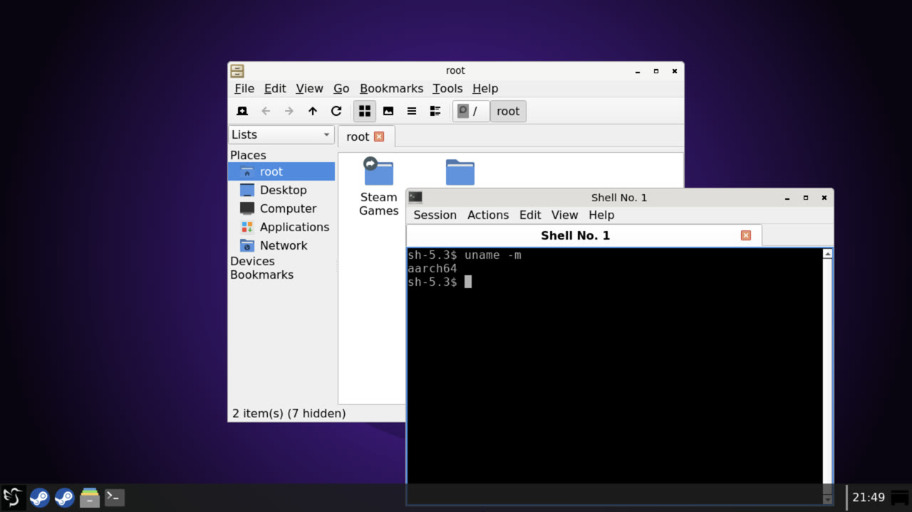
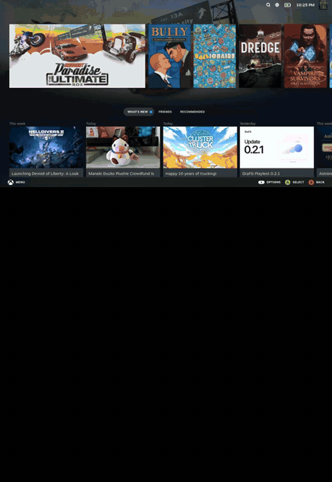
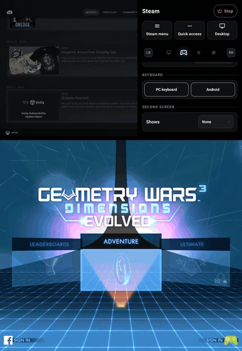
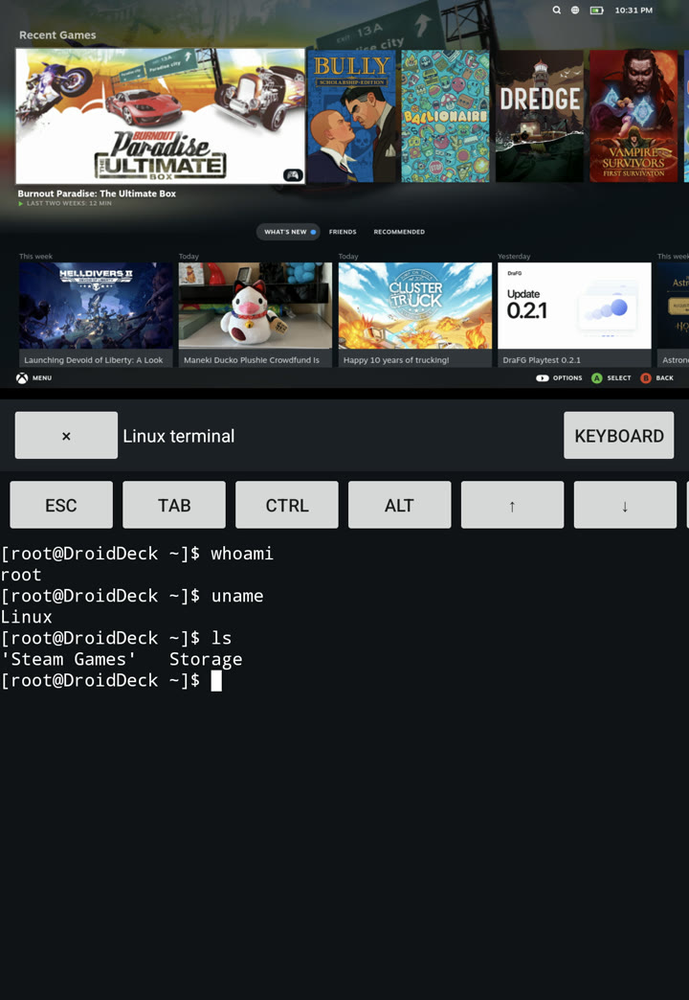

  <picture>
    <source media="(prefers-color-scheme: dark)" srcset="artwork/droiddeck-banner-dark.svg">
    
  </picture>

DroidDeck brings the SteamOS experience to Android. It runs Valve's own Steam client in Big Picture on your Adreno handheld, and Windows games run through Proton just like on a Steam Deck, using Valve's ARM64 build. Around that, you get a launcher built for controllers, a menu over any game, an optional Linux desktop with emulators, and it can be your Android home screen. On dual-screen handhelds, the second screen can run an Android app, a keyboard and trackpad, or a terminal.

Under the hood, the ARM64 Steam client runs natively in a Linux runtime (proot, gamescope and DroidDeck's own Vulkan compositor), and FEX translates x86 games. Nothing from Valve is bundled; Steam downloads from Valve on your device.

## Requirements and install

Use Android 9 or newer on a supported Adreno device (730 or newer, or 8xx). Mali, Xclipse, PowerVR, and Adreno 710 are unsupported. No root is required. Allow about 3 GB for the runtime and 1.1 GB more for the desktop and emulators. Install the APK from [Releases](https://github.com/The412Banner/DroidDeck/releases), install the Linux runtime, then press **Play** and sign in. Steam downloads on first launch. Install **Desktop & apps** to use the desktop and emulators.

On Android 12+, if Steam exits without a log, turn off **Restrict child processes** in Developer options.

## Build

Run `tools/build_local.sh` with Docker, Java 17, the Android SDK/NDK, and `zstd` installed. It builds the ARM64 audio sinks from PulseAudio 13.0 and packages them into the APK at `app/build/outputs/apk/release/app-release.apk`. Set `DROIDDECK_PA13_SOURCE_DIR` to an existing PulseAudio 13.0 source directory to skip downloading it. To install the APK on an attached device, run `tools/deploy_local.sh`.

## Limits

Compatibility and performance vary by device; hardware validation is limited. Desktop compositing uses software rendering. Firefox sandboxing is reduced under proot. See the session logs in `Download/DroidDeck/` when diagnosing problems.

## Credits and licence

GPL-3.0. Runtime, shim, input, and controller work build on WinNative and Bannerlator (maxjivi05). See [LICENSE](LICENSE). Steam and Proton belong to Valve Corporation; this project is not affiliated with Valve.
